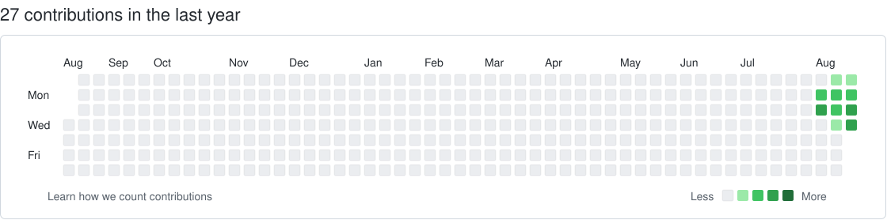

# OnStep Telescope Controller — Custom

基于 [hjd1964/OnStep](https://github.com/hjd1964/OnStep) `release-4.24` 开发的自定义 OnStep 固件

本项目主要用于自制谐波赤道仪及 MaxESP3 控制器，在原始 OnStep 4.24 基础上针对实际硬件和使用需求进行了修改

> [!IMPORTANT]
> 本项目是 OnStep 的非官方修改版本
>
> OnStep 原项目及核心固件由 **Howard Dutton** 开发和维护
>
> 本仓库中的自定义修改由 **Leo-John233 及项目贡献者**维护，具体修改内容和日期以 Git 提交历史为准

> [!WARNING]
> 本版本包含针对特定硬件的控制逻辑修改，不保证完全兼容所有 OnStep 支持的硬件
>
> 使用前请根据实际设备检查硬件配置、电机参数、PinMap、Home 和 Limit 等相关设置

## 分支说明

| 分支 | 用途 |
| --- | --- |
| `release-4.24-original` | 保存原始 OnStep 4.24 基线，用于代码比较和版本参考 |
| `release-4.24` | 当前自定义稳定版本 |
| `release-4.24-dev` | 开发和测试版本 |

一般使用建议选择：

`release-4.24`

开发中的功能和未经完整验证的修改位于：

`release-4.24-dev`

原始 OnStep 4.24 基线保存在：

`release-4.24-original`

## 主要修改

相对于原始 OnStep 4.24，本项目主要进行了以下调整：

- MaxESP3 硬件适配
- TMC2209 驱动及细分逻辑调整
- RA / DEC 控制逻辑调整
- RA / DEC 功能解耦
- Home 回零逻辑修改
- 物理限位逻辑调整
- GOTO 相关问题修复
- ZWO 控制设备兼容性调整
- 独立回零按键支持
- Config.h 配置调整
- 中文注释及代码整理

具体修改内容及版本变化请参阅本仓库 Git 提交记录

## Upstream

原始项目：

[hjd1964/OnStep](https://github.com/hjd1964/OnStep)

上游基础版本：

`OnStep release-4.24`

本仓库保存的原始基线：

`release-4.24-original`

原作者：

**Howard Dutton**

## What is OnStep?

OnStep is a computerized telescope GOTO controller based on Teensy or Arduino control of stepper motors.

It supports equatorial mounts such as GEM and Fork mounts, as well as Alt-Az mounts including Dobsonians.

OnStep was designed as a general-purpose telescope control system and can be configured for a variety of telescope mounts and controller hardware.

Depending on the controller configuration, OnStep supports several communication methods including:

- USB
- Bluetooth
- Wi-Fi
- Ethernet
- Serial communication

OnStep is compatible with the LX200 protocol and can be used with astronomy software including:

- SkySafari
- Stellarium
- Cartes du Ciel
- ASCOM-compatible applications
- INDI-compatible applications
- KStars

For complete documentation, hardware designs and configuration information, please refer to the original OnStep project.

## Documentation

- [Official OnStep Repository](https://github.com/hjd1964/OnStep)
- [OnStep Wiki](https://groups.io/g/onstep/wiki/home)
- [OnStep Group](https://groups.io/g/onstep/)

## Support

对于原始 OnStep 功能和通用配置问题，请优先参考 OnStep 官方仓库、Wiki 和 OnStep Group

对于本仓库自定义修改相关的问题，包括：

- MaxESP3
- TMC2209
- RA / DEC 控制逻辑
- Home 回零
- 物理限位
- GOTO
- ZWO 兼容
- 独立回零按键
- Config.h
- PinMap
- 其他本仓库特有修改

请优先以本仓库代码、配置和 Git 提交记录为准

在向 OnStep 上游报告问题前，建议先确认该问题是否同样存在于未经修改的官方 OnStep 固件中

## License

OnStep is open-source software licensed under the **GNU General Public License v3.0 (GPL-3.0)**.

This modified version continues to be distributed under the GNU General Public License v3.0.

Original OnStep project:

[hjd1964/OnStep](https://github.com/hjd1964/OnStep)

Original author:

**Howard Dutton**

See [LICENSE.txt](./LICENSE.txt) for the complete license text.

## Authors and Maintainers

### Original OnStep Author

**Howard Dutton**

### Custom Version

Custom modifications and maintenance:

**Leo-John233 and project contributors**

完整修改内容及修改日期请参阅本仓库 Git History

---

## 📝 最近代码修改

<!-- RECENT_CHANGES:START -->
<!-- RECENT_CHANGES:END -->

## 🟩 Repository Activity

